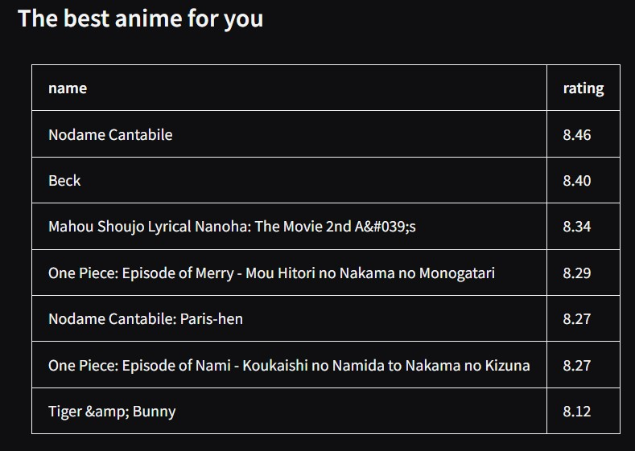

# Gradio interface for clustring recomendation system
The project is an implementation of the gradio interface for a [recommender system](https://github.com/michael-bmstu/clustering_recomend_system).

## Project struct
* **`app`** : app directory
    * `interface.py` : creating gradio interface
    * `logger.py` : logger initialization
    * `utils.py` : auxiliary functions
* `main.py` : main application file (combines all functions)
* `preprocess.py` : script for dvc pipeline
* `log` : application logs
* **`data`** : data directory
* **`weigths`** : directory with model weights
* `dvc.lock` : hash of files tracked by dvc
* `dvc.yaml` : dvc stage configuration (pipeline, tracked files and parameters)
* `params.yaml` : parameters for dvc
* `requirements.txt` : necessary packages for the project

## Launch of the project
Here are some options to run on your machine. 

For correct operation it is necessary to install data from kaggle by the [link](https://www.kaggle.com/datasets/CooperUnion/anime-recommendations-database)
(anime.csv, rating.csv).

### Manual launch using commands in the terminal (windows cmd)
```
python -m venv app_venv
app_venv\Scripts\activate
pip install --no-cache-dir -r requirements.txt
dvc repro
fastapi run main.py --host localhost --port 8000
```
Open your web browser and go to `http://localhost:8000`

### Docker container (build)
```
docker build -t rec-sys .
docker run -d -p 8000:8000 rec-sys
```

### Docker compose
///

## Main features

### 1. Distribution of genres by rating categories

Depending on the category, the genre will be assigned a rating from 1 to 10:
- good = 10
- normal = 6
- bad = 2


The more genres you distribute, the more accurate the recommendation will be. Total genres 43

### 2. Viewing history

Using search you can add anime to your viewing history and they will not be recommended.


### 3. Slider for selecting the number of recommendations (from 1 to 15)

The number selected represents the number of anime that will be recommended.

### The result of the program's work
The result is a table that presents anime titles in descending order of rating.

